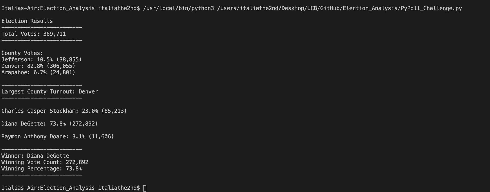

# Election Audit

## Overview of Election Audit
This is an election audit of tabulated results completed by the Colorado Board of ELections for the U.S. Congressional Precinct in Colorado. The purpose of this election audit is to generate a vote count repot to certify this U.S. Congressional race. The three voting methods taken into account were mail-in ballots, punch cards, and direct recording electronic. The report contains the total number of votes cast, the total number of votes for each candidate, the percentage of votes for each candidate, the winner of the election based on popular vote. 

The process was automated with Python 3.7.6. The automation was successful and may be used to audit other congressional districts, senatorial districts and local elections.

## Election-Audit Results 
- Total Votes Cast in this Congressional Election: **369,711**
- Number of Votes and Percentage of Total Votes by County:
- Largest number of votes:
- Number of Votes and Percentage of Total Votes by Candidate:
- Winner of the Election:  Vote Count:  Percentage of Total Votes: 
  
  

## Election Audit Summary
In a summary statement, provide a business proposal to the election commission on how this script can be used—with some modifications—for any election. Give at least two examples of how this script can be modified to be used for other elections.
